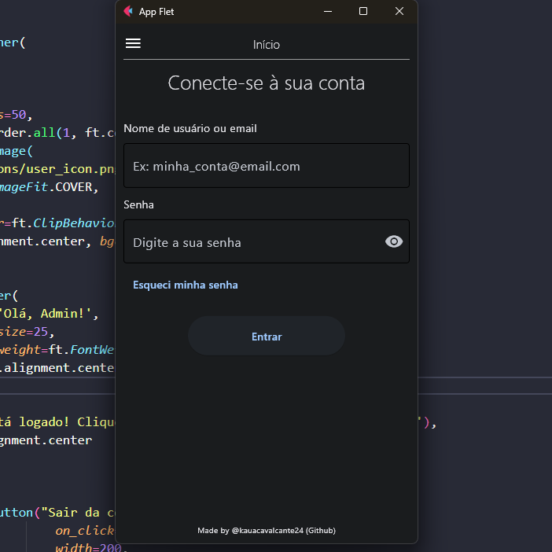
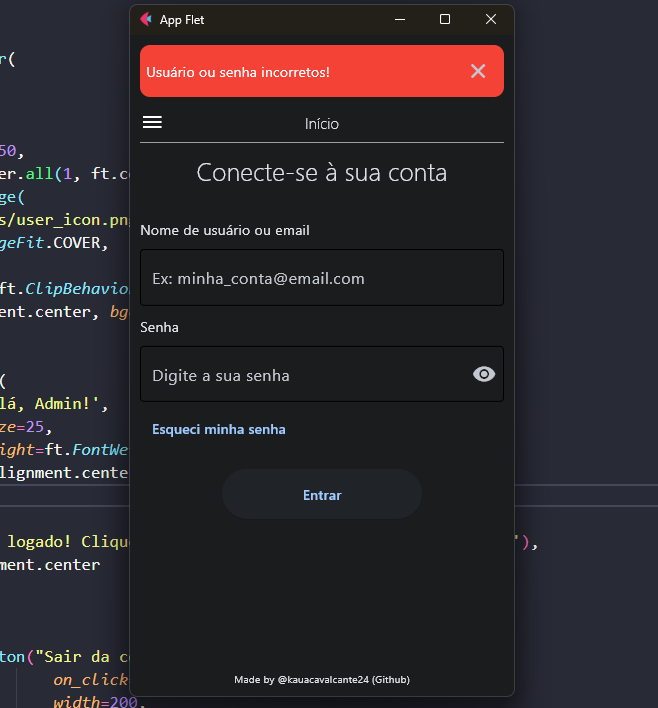
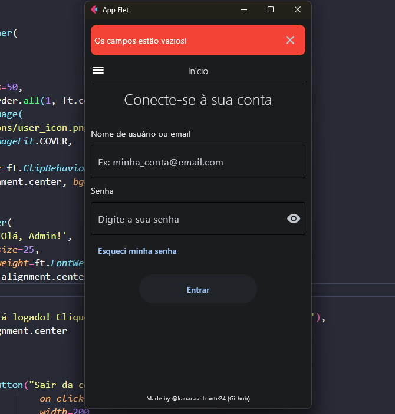
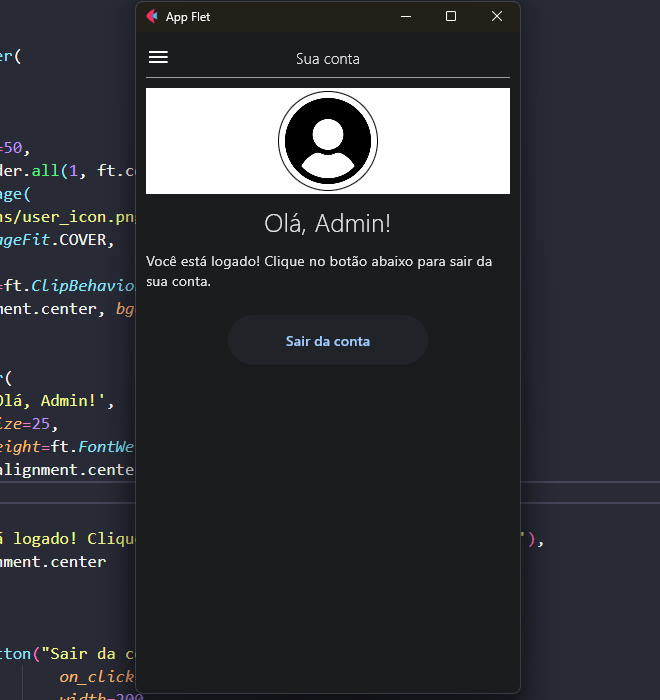

# Página de Login
Uma simples tela de login feita com Python e o framework Flet.

---

## Imagens da Interface

> ### Tela Inicial

    

> ### Validação de Usuário

    

> ### Campos Vazios

    

> ### Visualizar Perfil

    

