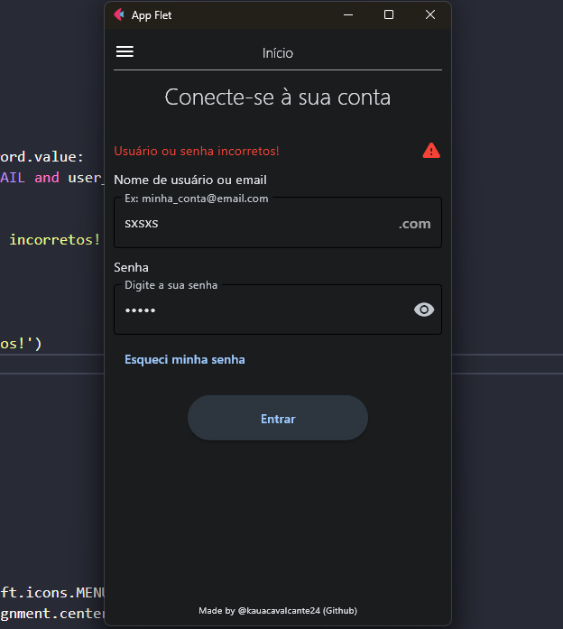
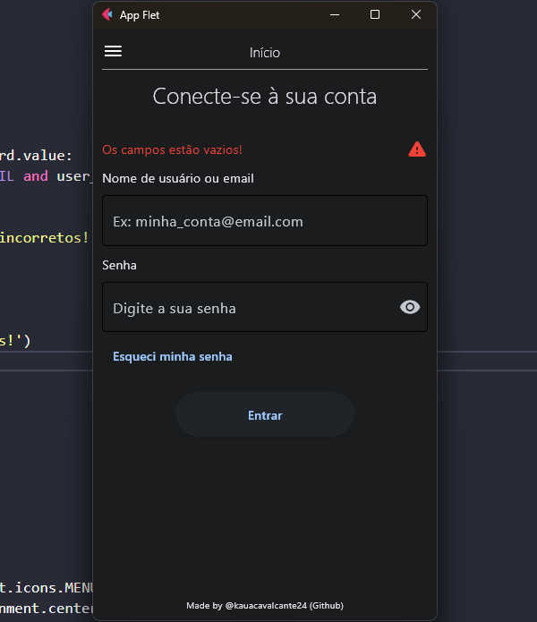

# Página de Login
Uma simples tela de login feita com Python e o framework Flet.

---

## Requisitos
> ### Tenha o Python instalado
Verifique se o Python está instalado utilizando o seguinte comando no terminal:
<pre> python --version </pre>

> ### Tenha o Flet instalado
Com o Python instalado, chegou a hora de instalar o Flet também pelo terminal:
<pre> pip install flet </pre>

## Imagens da Interface

> ### Tela Inicial

    

> ### Validação de Usuário

    

> ### Campos Vazios

    

> ### Visualizar Perfil

    

